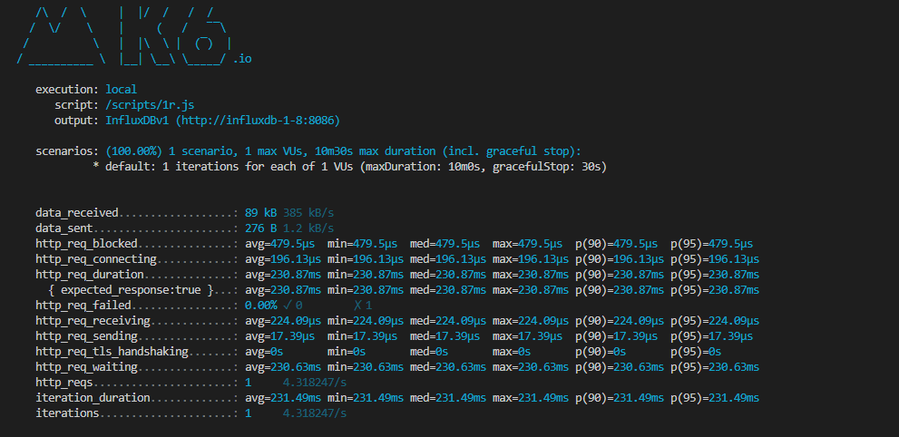
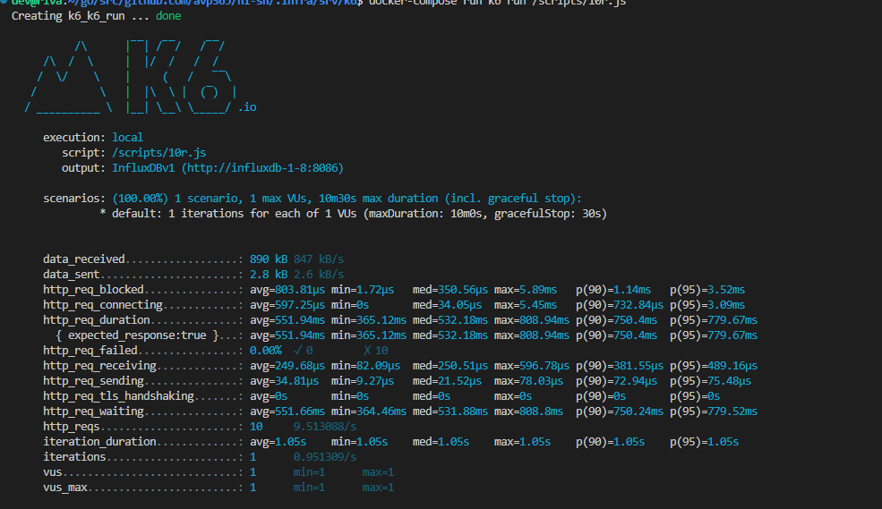
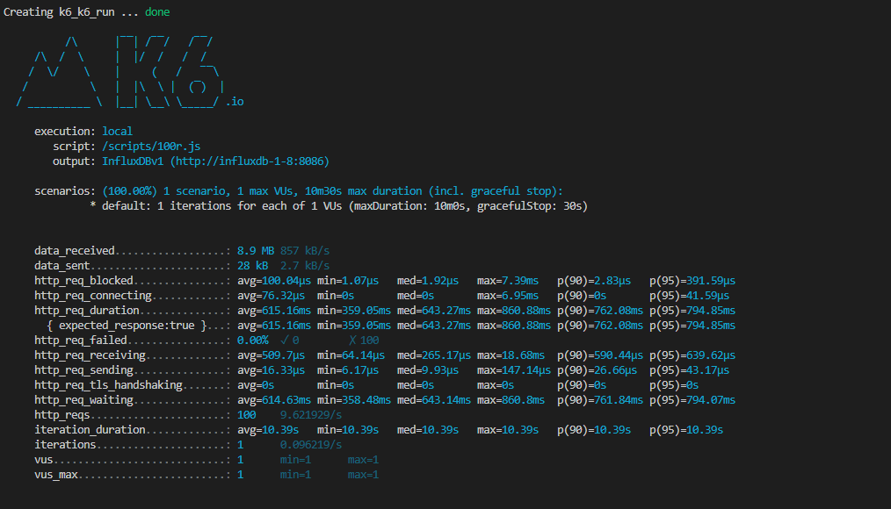
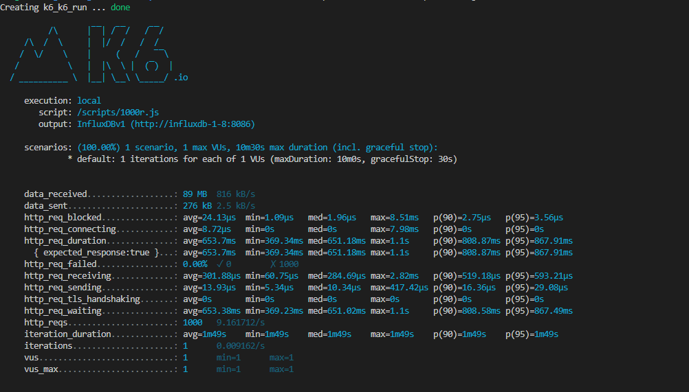
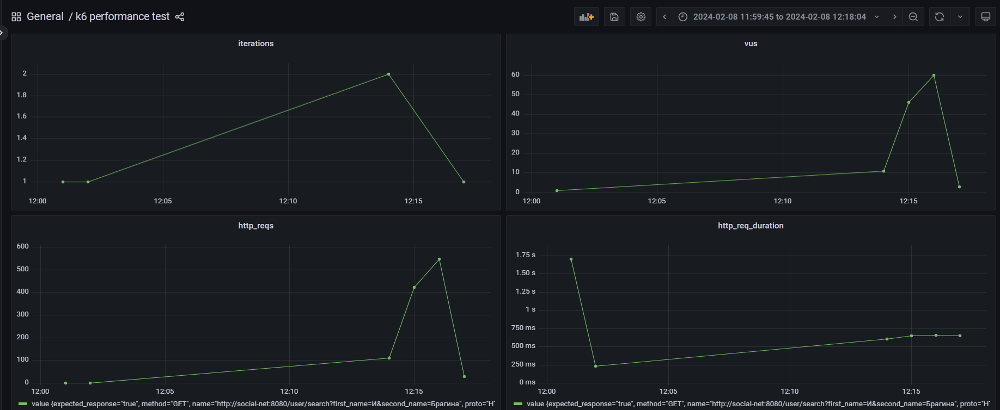
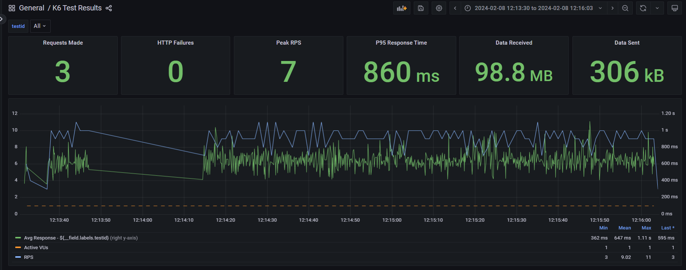
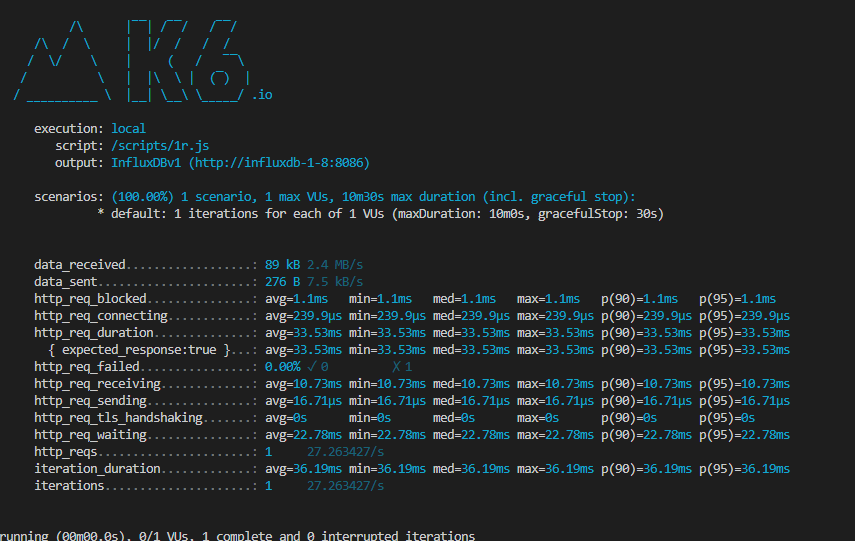
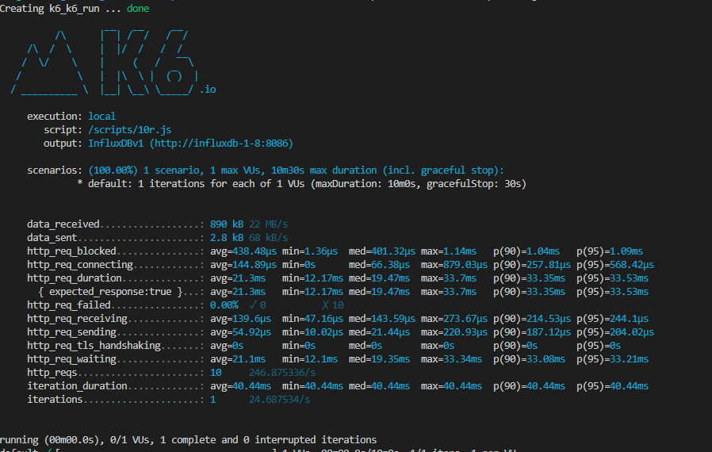
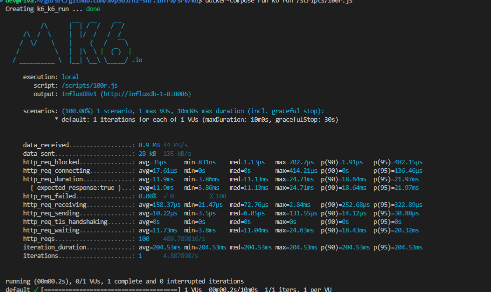
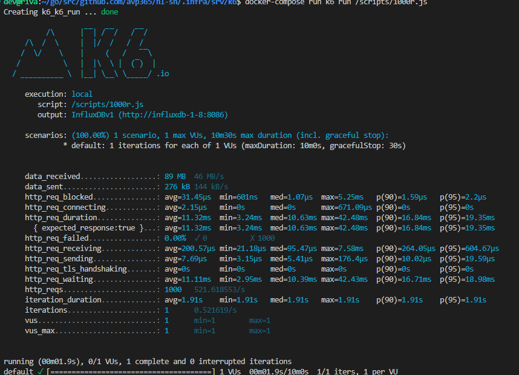

# Отчет по тестироваиню запроса /user/search?first_name=И&second_name=Брагина без индексов и с индексами.
Используем k6. Скрпиты находятся в "корень проекта/.infra/srv/k6/scripts"
## Тестирование до введения индекса
### Параметры тестирования
#### 1 запрос

#### 10 паралельных запросов 

#### 100 паралельных запросов 

#### 1000 паралельных запросов 

#### График "Производительность"

#### график "Общий"

###  Анализ.
Из данных r1.png и т.д. а так же графиков поулучаем, что минимальный http_req_duration (latency) 230.87 ms при 1 запросе и 643.7 при 1000 запросах. Делаем вывод, что чем больше запросов, тем задержка увеличивается, сильно с 1 до 10  (примерно 400ms) и менее заметно с 10 до 1000 (примерно 100ms). Максимальная пропускная способность 11

## Тестирование после введение индекса.

### Параметры тестирования
#### 1 запрос

#### 10 паралельных запросов 

#### 100 паралельных запросов 

#### 1000 паралельных запросов 

#### График "Производительность"

#### график "Общий"

Из данных r1.png и т.д. а так же графиков поулучаем, что минимальный http_req_duration (latency) 33.53 ms при 1 запросе и 11.32ms при 1000 запросах. Делаем вывод, что чем больше запросов, тем задержка уменьшается,  с 1 до 10 в 2 раза (примерно на 10ms) и с 10 до 1000 (примерно 10ms). Максимальная пропускная способность 500

### Работа с запросами.
#### Запрос выборки.
SELECT id, first_name, second_name, birthdate, biography, city FROM  public.users where first_name LIKE 'И%'  AND second_name LIKE 'Брагин%' ORDER BY id
##### Ответ
Total rows: 290 of 290 Query complete 00:00:00.180
#### Запрос выборки с Explain
EXPLAIN ANALYZE SELECT id, first_name, second_name, birthdate, biography, city FROM  public.users where first_name LIKE 'И%'  AND second_name LIKE 'Брагин%' ORDER BY id
##### Ответ
Gather Merge  (cost=92558.86..92627.46 rows=588 width=502)
Execution Time: 130.649 ms

#### Создание индекса.
##### Index Bthree по умолчанию
CREATE INDEX index_b_three ON users (first_name, second_name);
#### Запрос выборки с Explain
EXPLAIN ANALYZE SELECT id, first_name, second_name, birthdate, biography, city FROM  public.users where first_name LIKE 'И%'  AND second_name LIKE 'Брагин%' ORDER BY id
##### Ответ
Gather Merge  (cost=92558.86..92627.46 rows=588 width=502)
Execution Time: 130.231 ms

##### Index Bthree по умолчанию
CREATE INDEX index_b_three ON users (first_name);
EXPLAIN ANALYZE SELECT id, first_name, second_name, birthdate, biography, city FROM  public.users where first_name LIKE 'И%'  AND second_name LIKE 'Брагин%' ORDER BY id
##### Ответ
Gather Merge  (cost=92502.01..92570.61 rows=588 width=502) (actual time=123.509..123.597 rows=290 loops=1)
Execution Time: 123.614 ms

##### Index Gin. Ставим расширения для полнотекстовго поиска. (пригодиться для поиска)
Документация: https://habr.com/ru/companies/postgrespro/articles/340978/
CREATE EXTENSION IF NOT EXISTS pg_trgm;
CREATE EXTENSION IF NOT EXISTS btree_gin;

##### Index Gin для одного имени (если создать для друго имени или вместе, эффектив - нет)
CREATE INDEX i_gin_name ON users using gin (first_name gin_trgm_ops);
EXPLAIN ANALYZE SELECT id, first_name, second_name, birthdate, biography, city FROM  public.users where first_name LIKE 'И%'  AND second_name LIKE 'Брагин%' ORDER BY id
##### Ответ. Время увеличилось
Sort  (cost=86266.54..86268.30 rows=705 width=502) (actual time=158.908..158.953 rows=290 loops=1)
Execution Time: 158.981 ms

##### Index Gin для двух имен,
CREATE INDEX i_gin_f_s_name ON users using gin (first_name gin_trgm_ops,second_name gin_trgm_ops);

#### Запрос выборки.
SELECT id, first_name, second_name, birthdate, biography, city FROM  public.users where first_name LIKE 'И%'  AND second_name LIKE 'Брагин%' ORDER BY id
##### Ответ
Sort  (cost=2809.81..2811.58 rows=705 width=502) (actual time=2.099..2.109 rows=290 loops=1)
Execution Time: 2.130 ms

## Вывод
Оптимальным индексом был выбран Generalized Inverted Index. Основная область применения метода gin — ускорение полнотекстового поиска, поэтому логично взять его и сделать составной индекс из имени и фамилии. В среднем время выполнения запроса уменьшается примерно 70 раз, макс. произвоидетельность увеличивается в 50 раз.